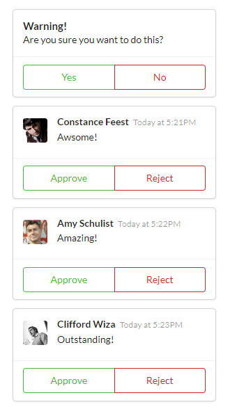

# Components

Independent, reusable pieces of UI.

This simple application renders a list of comments that can be rejected or approved. It showcases how to work with components, props and children.

## Components

`ApprovalCard` - Wraps children components in a container that displays Approve and Reject buttons.\
`CommentDetail` - Displays information about a comment.

## Getting Started

In the project directory, you can run:

### `npm install`

Installs project dependencies.

### `npm start`

Runs the app in the development mode.\
Open [http://localhost:3000](http://localhost:3000) to view it in the browser.
