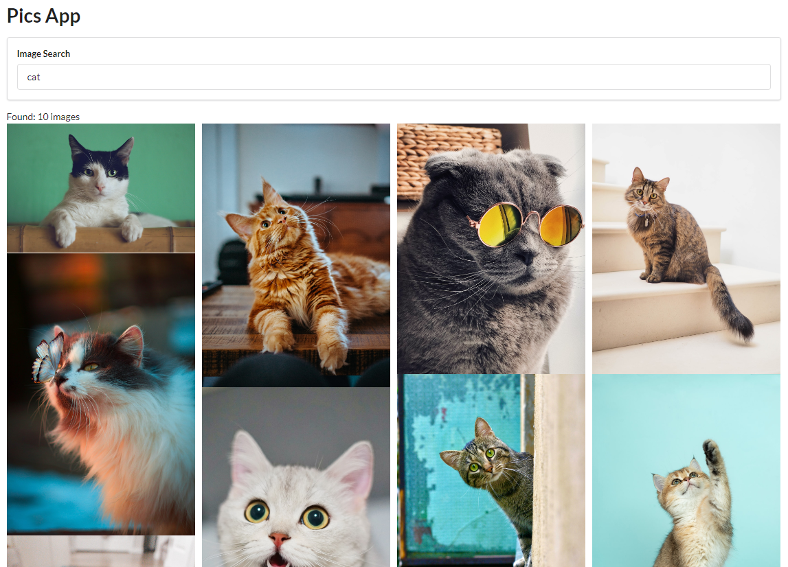

# Pics

A React application that demonstrates the use of controlled components, api calls using axios, list rendering and DOM access with Ref. 

This application allows to search for pictures by making use of Unsplash API and displays the result in a well formatted grid.



## Components

### `App`

Responsible for rendering `SearchBar` and `ImageList` components. Includes a method to make an API request. Also displays a number of images found.

### `SearchBar` 

Renders a controlled component that captures the search term and executes a function on form submit provided through the props.

### `ImageList`

Maps an array of images into `ImageCard` components.

### `ImageCard`

Manages the grid span of image.

## Getting Started

Get an API key from [Unsplash](https://unsplash.com/).

In the project root directory, create a file called `.env` with this content:

```
REACT_APP_ACCESS_KEY=<your_access_key>
```

Next, you can run:

### `npm install`

Installs project dependencies.

### `npm start`

Runs the app in the development mode.\
Open [http://localhost:3000](http://localhost:3000) to view it in the browser.

