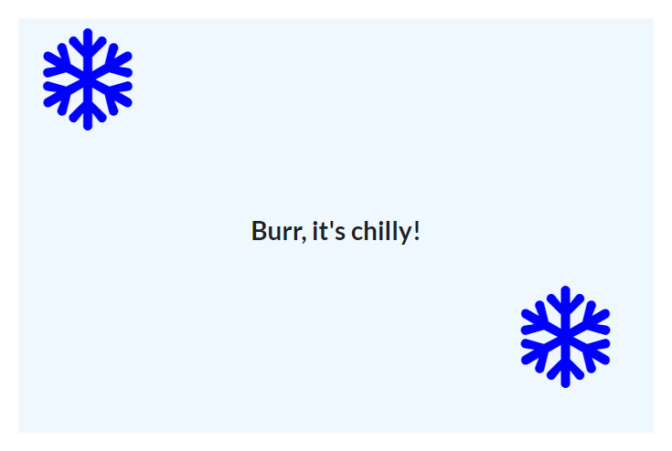
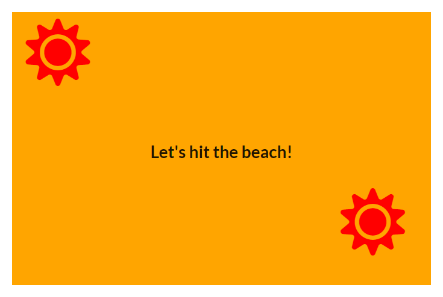

# Seasons

A React application that demonstrates the use of lifecycle methods in class-based components. With the help of geolocation, this application displays content that depicts the current season (winter or summer).

## Components

### `App`

Responsible for getting user location on mount and keeping location data in state. Displays a `Spinner` while it waits for the user to give permission to get their location. Shows an error message if access was denied. Otherwise, it renders `SeasonDisplay`.

### `SeasonDisplay` 

Chooses the appropriate styling and content based on latitude and month. 

### `Spinner`

Displays a spinner with customizable text. Uses defaultProps to set default text.

## Getting Started

### `npm install`

Installs project dependencies.

### `npm start`

Runs the app in the development mode.\
Open [http://localhost:3000](http://localhost:3000) to view it in the browser.