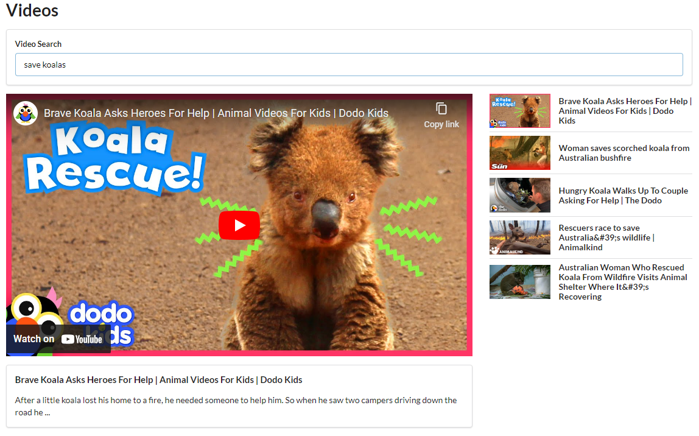

# Videos

A React application that allows to search and watch Youtube videos. It demonstrates how to send requests to Youtube API and elegantly display the data.



## Components

### `App`

Responsible for rendering `SearchBar`, `VideoDetail` and `VideoList` components. Includes a method to make an API request. Keeps track of videos and selected video in state.

### `SearchBar` 

Renders a controlled component that captures the search term and executes a function on form submit provided through the props.

### `VideoDetail`

Embeds selected video and displays its description.

### `VideoList`

Maps an array of videos into `VideoItem` components.

### `VideoItem`

Displays thumbnail and title of video. On click, it changes currently selected video.

## Getting Started

Get an API key from [Youtube](https://developers.google.com/youtube/v3).

In the project root directory, create a file called `.env` with this content:

```
REACT_APP_API_KEY=<your_api_key>
```

Next, you can run:

### `npm install`

Installs project dependencies.

### `npm start`

Runs the app in the development mode.\
Open [http://localhost:3000](http://localhost:3000) to view it in the browser.
